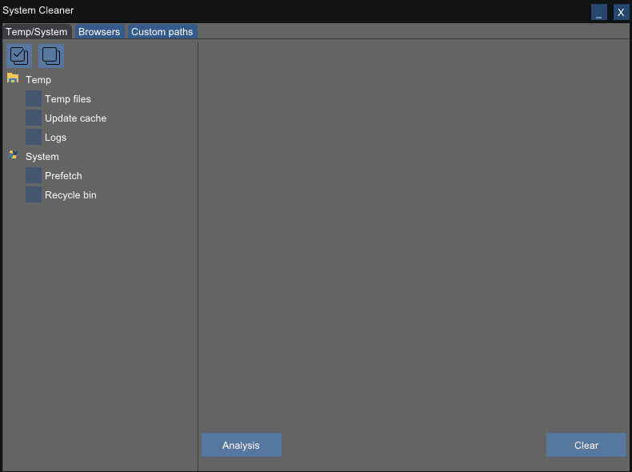
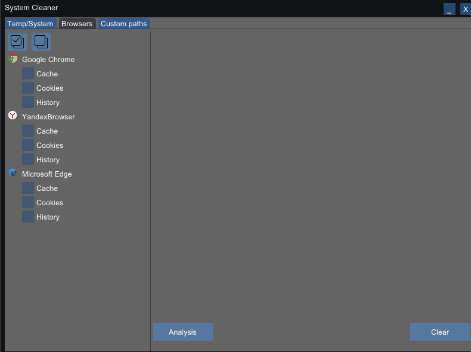
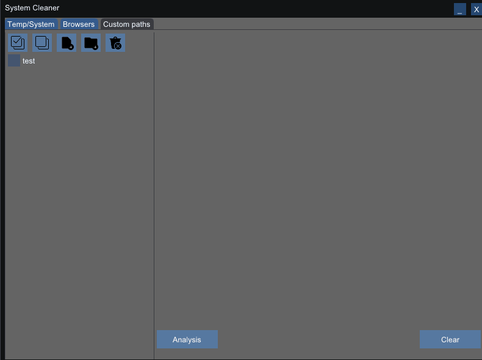

# SystemCleaner

The project is written in C++ using **ImGui** and **OpenGL/GLFW**.  
The project is built using **CMake**.

## Features

- Clean temporary files
- Remove cache files
- Clean custom paths and files

## Installation

### Requirements
- Windows
- Visual Studio 2022
- CMake

### Build

```bash
git clone https://github.com/deathcore1998/SystemCleaner
cd SystemCleaner
generate_vs.bat
```

## Demo

### Multiselection checkboxes


### Scanning and cleaning junk files


### Adding and removing custom paths


## Release

After building the project, you can generate the release executable using the provided batch file.

Run the release batch file:

```bash
build_release.bat
```
